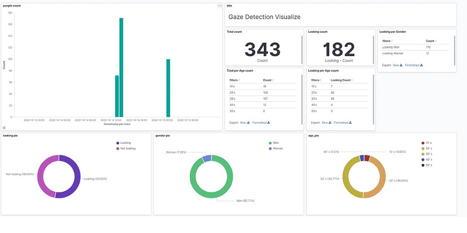

# Gaze Detection System
This is a repository of  Gaze Detection System using NVIDIA 's Jetson and DeepStream 6.0.

For example, it is useful for measuring the effectiveness of signage advertising.  
From webcom or pre-made videos, it detect the gaze of person watching and analyze the gender and age of that person. 
Each person detected will be drawn on bounding box. It is also possible to visualize data by an authorized Azure Iot Hub and linking with Open Distro for Kibana. 


  
  
 Gaze detection system used the content of 5 models:  
 The Face detection, Face landmarks, Gaze detection, Age estimation, and Gender estimation model. 


See [Reference of Content Models](model/README.md) out for details (including model's link).  
**Please note that the models are available for research, development, PoC purposes only.**  
For uses other than the above, please replace the model with another model.

## Prerequisite

- NVIDIA Jetson Platform
- [JetPack](https://developer.nvidia.com/embedded/jetpack) 4.6.1
- Video(H.264/H.265) or USB webcam

Test on:

- Jetson AGX Xavier, JetPack 4.6.1, Video, and USB webcam. 

Note: Recommend Jetson Xavier NX or AGX Xavier.  
The Age and gender prebuild engine model with TenserRT are built for Xavier GPU(compute capability 7.2).  
If you want to run on not Xavier(e.g. Nano), you need to rebuild them on your device.
See [model/readme](https://github.com/Ryoyo-NV/Gaze-Analysis-System/tree/main/model), and more.

## Installation
There are two options to setup and it can be run local or Docker container.

### Requirements:  

- [NVIDIA DeepStream](https://developer.nvidia.com/deepstream-sdk) 6.0.1
- TensorRT 8.2.1
- Gstremer 1.14.5

Options (using visualize data):
- Open Distro for ElasticSearch 1.10.1
- Open Distro for Kibana 1.10.1
- Azure Iot Hub
- Azure Visual Machine

Note: Excludes packages already included in JetPack. (ex. Python3.6, OpenCV, and etc.)  
See above for tested versions. 
### Option 1: Installing local  

#### 1. Install DeepStream SDK
Installing the five methods. Using the DeepStream tar package here.  
Download package [here](https://developer.nvidia.com/deepstream-getting-started) .

```
sudo apt install deepstream-6.0
```
See [NVIDIA DeepStream SDK Developer Guide](https://docs.nvidia.com/metropolis/deepstream/dev-guide/text/DS_Quickstart.html#install-the-deepstream-sdk) , and more.  


#### 2. Clone this repository & Execute setup.sh
```
git clone https://github.com/Ryoyo-NV/Gaze-Analysis-System
cd Gaze-Analysis-System
chmod +x setup.sh
./setup.sh
```

Note1: setup.sh requires sudo password to install some apt packages.

Note2: It takes about 15 minutes to finish. 


### Option 2: Building  docker image 

TBD


## Usage 
Set the path for cvcore_libs to LD_LIBRARY_PATH env.

```
export LD_LIBRARY_PATH=/opt/nvidia/deepstream/deepstream/lib/cvcore_libs:$LD_LIBRARY_PATH
```

### With Kibana
Run the command after starting the Open Distro for Elasticsearch(Elasticsearch, Kibana) service. The data of visualize is sent to Open Distro for Elasticsearch.  

Using video file, path to own video file dir. See `python3 run.py -h` for detailed options.
```
python3 run.py [PATH/TO/VIDEO_DIR/VIDEO] --codec h264
```

Using USB webcam, using `--media` argument, path to USB webcam.  
```
pyhon3 run.py [PATH/TO/WEBCAM] --media v4l2 
```
### Without Kibana
Only Draw the bounding box, gender and age on the display.

1. Comment out of `run.py` the following:
  ```
  #comment out of part1  
    from message_manager import MessageManager
    from config import Config
  
  #comment out of part2 
    config = Config()
    message_manager = MessageManager(config)
    gaze_msg_sender = GazeMessageSender(message_manager, send_msg_interval=5.0)

  #comment out of part3
    gaze_msg_sender(faces, gaze_cpu)
  ``` 

2. Save file and run file  
Same command with Kibana. See With Kibana command.


##  Data analysis and visualization
Data analysis and visualization with Open Distro for Kibana.  
After access and login the Open Distro for Kibana, create Visualization and Dashboard.
Refer to the [README guide](kibana/README.md#Create-visualization-and-Dashboard) in kibana directory for the creating visualization details.

For example, created the Visualization and Dashboard as follow:



## Licenses
Copyright (C) 2020, Ryoyo-NV All rights reserved.  
The models are available for research, development, and PoC purposes only.
